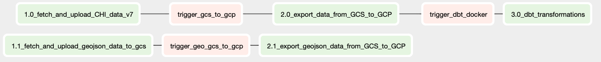

# Chicago Traffic Crash Insights Dashboard

Data Engineering project that orchestrates weekly ETL pipelines with Airflow to process and transform over 4.6M rows of Chicago crash and geospatial data. Data is modeled in BigQuery using a star schema with dbt, featuring data validation and testing to support KPIs and dashboards. The project includes an interactive Tableau dashboard to visualize crash trends and geographic distribution, with scalable infrastructure automated in Google Cloud Platform using Terraform.

[View Tableau Dashboard](https://public.tableau.com/shared/5BNTZ4Q3G?:display_count=n&:origin=viz_share_link)

## Table of Contents
- [Key Components](#key-components)
- [Architecture](#architecture)
- [Data Model](#data-model)
- [ETL Flow](#etl-flow)
- [Dashboard](#dashboard)

## Key components:
- **Data orchestration**: Apache Airflow pipelines for data ingestion and transformation.
- **Infrastructure**: Provisioned cloud resources using Terraform for reproducibility and scalability.
- **Analytics**: Transformations using dbt in BigQuery for streamlined reporting.
- **Visualization**: Dashboard with Tableau to explore key crash metrics.

## Architecture

## Data Model

### Taking a Functional Approach
The approach taken in this project follows the principles of **Functional Data Engineering**, where all tables are time-partitioned. This means that each ETL load stores **a full snapshot of the data** at the time of the load, ensuring that the current state of the data is preserved. By storing the snapshot in Parquet format within Google Cloud Storage (GCS), we maintain an unprocessed, immutable copy of the data from each run cycle.

This approach offers several advantages:
- **Data versioning**: Every load produces a snapshot of the data at a particular point in time, allowing us to track changes or roll back to earlier states if necessary.
- **Data integrity**: By always loading the full snapshot, the system ensures data completeness, mitigating issues like partial data ingestion.
- **Simplified backfills**: Historical backfills become easier because all previous states are available in GCS, allowing for smooth recovery from processing failures.

When the data is loaded into BigQuery, a **partition date column** is added, corresponding to the ETL run date. This partitioned data is then appended to the relevant raw tables in BigQuery. Thus, BigQuery stores a comprehensive set of raw data snapshots, each distinguished by its partition date.

For downstream transformations using dbt, only the **latest partition date** is selected. This ensures that all analytics models, marts, and dashboards are built off the **most recent full snapshot of the data**, providing up-to-date insights while preserving previous states for auditability.

## ETL Flow

### General Overview

### ETL Details
- **Crash Data Ingestion** : Traffic crash data, along with associated people and vehicle data, is fetched from the Chicago Data Portal using the SODA API. The data is converted to *Parquet* format and stored in Google Cloud Storage (GCS).

- **Geospatial Data** : Geospatial data for Chicago neighborhoods and wards is also fetched from Chicago Data Portal using the SODA API and stored in GCS.

- **Loading Crash Data to Big Query** : Crash data is loaded from GCS to BigQuery, where a parition date column (signifying the load date) is added and the data appended to BQ tables.

- **Geospatial Data Processing and Loading** : Geospatial data is processed by converting it from GeoJson to newline-delimited GeoJson format, making it suitable for upload to BigQuery. A partition date column is added, and the data appended to BQ tables.

## Dashboard

