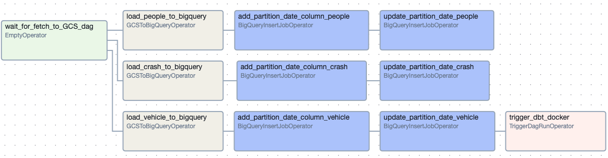

# Chicago Traffic Crash Insights Dashboard

Data Engineering project that orchestrates weekly ETL pipelines with Airflow to process and transform over 4.6M rows of Chicago crash and geospatial data. Data is modeled in BigQuery using a star schema with dbt, featuring data validation and testing to support KPIs and dashboards. The project includes an interactive Tableau dashboard to visualize crash trends and geographic distribution, with scalable infrastructure automated in Google Cloud Platform using Terraform.

[View Tableau Dashboard](https://public.tableau.com/shared/5BNTZ4Q3G?:display_count=n&:origin=viz_share_link)

## Key components:
- **Data orchestration**: Apache Airflow pipelines for data ingestion and transformation.
- **Infrastructure**: Provisioned cloud resources using Terraform for reproducibility and scalability.
- **Analytics**: Transformations using dbt in BigQuery for streamlined reporting.
- **Visualization**: Dashboard with Tableau to explore key crash metrics.

## Architecture

## Data Model

## ETL Flow

### General Overview

### ETL Details
- **Crash Data Ingestion** : Traffic crash data, along with associated people and vehicle data, is fetched from the Chicago Data Portal using the SODA API. The data is converted to *Parquet* format and stored in Google Cloud Storage (GCS).

- **Geospatial Data** : Geospatial data for Chicago neighborhoods and wards is also fetched from Chicago Data Portal using the SODA API and stored in GCS.

- **Loading Crash Data to Big Query** : Crash data is loaded from GCS to BigQuery, where a parition date column (signifying the load date) is added and the data appended to BQ tables.

- **Geospatial Data Processing and Loading** : Geospatial data is processed by converting it from GeoJson to newline-delimited GeoJson format, making it suitable for upload to BigQuery. A partition date column is added, and the data appended to BQ tables.

